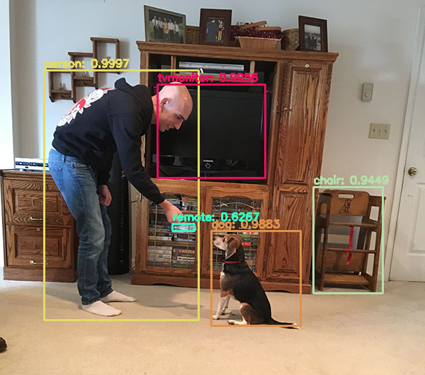
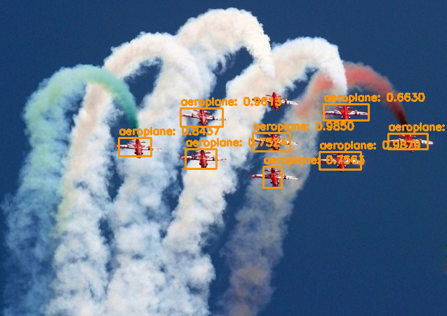

# YOLO-v3
You Only Look Once Version-3

# Collaborator
Prayushi Mathur, Vraj Patel

This repository contains the files related to implementation of YOLO v3 model based on the paper of pjreddie darknet. The dataset used here is YOLO-coco. We have implemented this model on images and videos.

# Introduction
Object detection is one of the most important application of deep learning in real life. YOLO which stands for 'You Only Look Once' is a state-of-the-art method. This algorithm is extremely fast and can be used in real time multi object detection. The algorithm traces an image only once and gives the result accordingly. The results include the following:

- Bounding Boxes: These are a rectangular boxes which specify the location of the target. They are made by the x and y axis coordinates in the upper-left corner and the x and y axis coordinates in the lower-right corner of the rectangle.

-Name of Object: The name of the object detected by the bouding boxes are shown in the predicted result.

-Confidence Score: This is the score determining the proability of an object in the anchor box. When the confidence score of a detection that is supposed to detect a ground-truth is lower than the threshold, the detection counts as a false negative (FN). On the other hand, when the confidence score of a detection that is not supposed to detect anything is lower than the threshold, the detection counts as a true negative (TN). 

# Model Description
<table>
    <tr>
        <td></td>
        <td>ENVIRONMENT DESCRIPTION </td>
    </tr>
        <tr>
        <td>Tensorflow Version</td>
        <td>1.13.1</td>
    </tr>    
    <tr>
        <td>Python Version</td>
        <td>3.6.7</td>
    </tr>    
    <tr>
        <td></td>
        <td>SYSTEM DESCRIPTION</td>
    </tr>    
    <tr>
        <td>Platform</td>
        <td>Google Colab Cloud Platform</td>
    </tr>    
    <tr>
        <td>CPU</td>
        <td>Dual Core - Intel(R) Xeon(R)</td>
    </tr>    
    <tr>
        <td>Clock Speed</td>
        <td>2.30 GHz</td>
    </tr>    
    <tr>
        <td>Cache Size</td>
        <td>46 MB</td>
    </tr>    
    <tr>
        <td>RAM</td>
        <td>13.335276 GB</td>
    </tr>    
    <tr>
        <td>Disk Space</td>
        <td>358 GB</td>
    </tr>    
    <tr>
        <td>GPU</td>
        <td>Nvidia Tesla K80</td>
    </tr>    
    <tr>
        <td>GPU Cores</td>
        <td>2496 CUDA cores</td>
    </tr>    
    <tr>
        <td>Cuda Compute Capability</td>
        <td>Compute 3.7</td>
    </tr>    
    <tr>
        <td>GPU RAM</td>
        <td>15.079 GB</td>
    </tr>    
    <tr>
        <td></td>
        <td>DATASET DESCRIPTION</td>
    </tr>    
    <tr>
        <td>Name</td>
        <td>COCO Trainval</td>
    </tr>    
     <tr>
        <td>Size</td>
        <td>330,000 Images</td>
    </tr> 
         <tr>
        <td>Resolution</td>
        <td>640x480</td>
    </tr> 
    <tr>
        <td>Spatial Extent</td>
        <td>Complex spatial context between stuff and things</td>
    </tr> 
        <tr>
        <td>Characteristics</td>
        <td>COCO is a large-scale object detection, segmentation, and captioning dataset. COCO has several features: Object segmentation, recognition in context, superpixel stuff segmentation, 330k images(>200k labelled), 1.5 million object instances, 80 object categories, 91 stuff categories, 5 caption per image, 250,000 people with keypoints.</td>
    </tr> 
        <tr>
        <td>Number of Object Classes</td>
        <td>80</td>
    </tr> 
        <tr>
        <td></td>
        <td>Experimentation</td>
    </tr> 
        <tr>
        <td>Training Data Size</td>
        <td>80,000 Images</td>
    </tr> 
        <tr>
        <td>Validation Data Size</td>
        <td>40,000 Images</td>
    </tr> 
        <tr>
        <td>Testing Data Size</td>
        <td>-</td>
    </tr> 
    <tr>
        <td>Optimizer</td>
        <td>Adam</td>
    </tr> 
    <tr>
        <td>Learning Rate</td>
        <td>0.001( To avoid overshooting in the complex objective function minima )</td>
    </tr> 
    <tr>
        <td>Batch Size</td>
        <td>64</td>
    </tr> 
    <tr>
        <td>Steps per epoch</td>
        <td>68</td>
    </tr> 
    <tr>
        <td>Time per epoch step</td>
        <td>0.25s/step</td>
    </tr> 
    <tr>
        <td>Epochs</td>
        <td>100</td>
    </tr> 
    <tr>
        <td>Time per Epoch</td>
        <td>17s/epoch</td>
    </tr> 
    <tr>
        <td></td>
        <td>Evaluation</td>
    </tr> 
    <tr>
        <td>Loss Function</td>
        <td>YOLOv3 loss function</td>
    </tr> 
    <tr>
        <td>Average Loss</td>
        <td>0.6</td>
    </tr> 
    <tr>
        <td>Loss</td>
        <td>0.5</td>
    </tr> 
      
</table>
# Introduction Of Files Contained In The Repository
-yolo_v3.py - This python file contains the code of the model
-yolov3.weights - This file contains the weights used in the model.
-yolov3.cfg- This file contains the configuration of the model.
-images - This folder contains some sample images for testing.

# Steps To Run The Model
1.) Clone the repository.
2.) Open the folder and run the below command in the command prompt for object detection on image:
'python yolo_v3.py --image images/baggage_claim.jpg --yolo yolo-coco'

Open the folder and run the below command in the command prompt for object detection on video:
'python yolo_video.py --input videos/airport.mp4 --output output/airport_output.avi --yolo yolo-coco'

(Change the name of the image accordingly)

# Result

